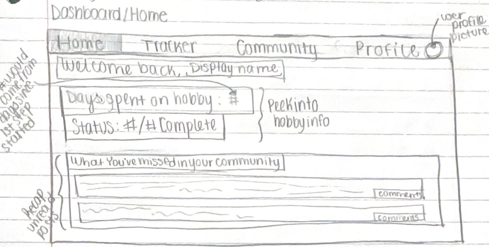
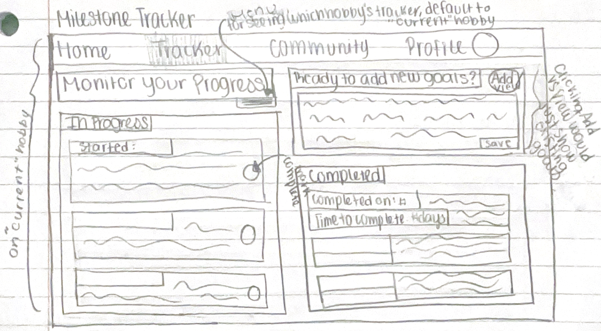
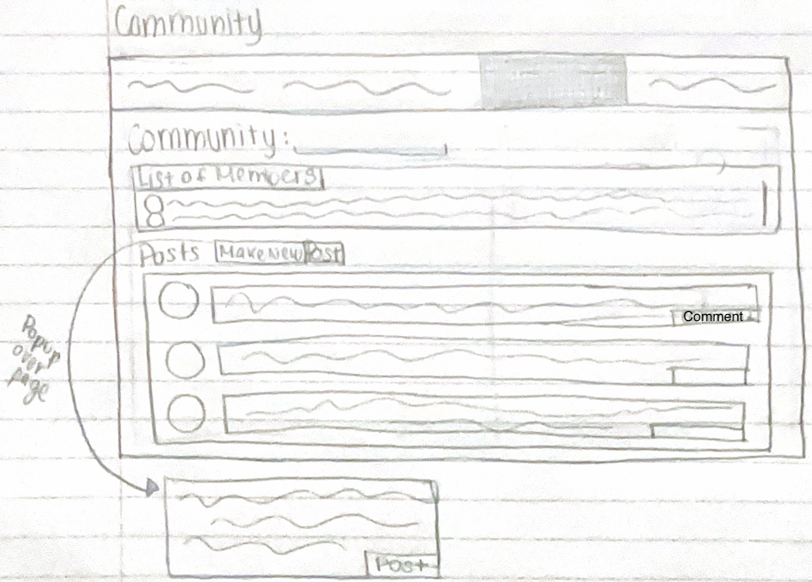
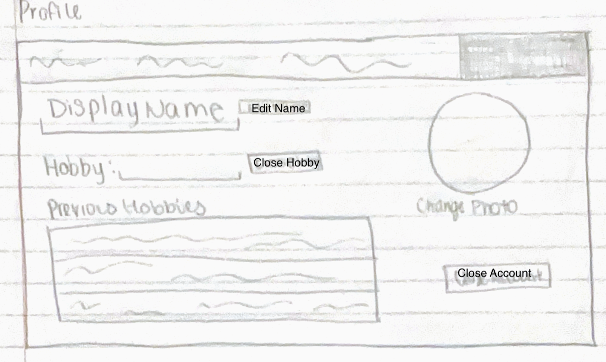

# Assignment 2
Gloria Pulido
[ReadMe](../README.md)

## 1. Problem statement
### A problem domain

#### Developing new hobbies.
When I consider my hobbies, I think a lot about how there are many that I have never thought to even explore. My friends have introduced me to interesting ones such as crocheting, which have all been nice opportunities to learn about something new. I always want to make sure that I am open to new hobbies, especially ones that I haven’t heard of, which I am certain is a common feeling among others. Everyone is looking for ways to spend their free time, and it is interesting to see how anything can turn into a hobby, from bird watching to making sourdough bread. 

### A problem

#### Staying accountable to a hobby.
People are always searching for something to do and wanting to grow, but most of those same people will also deal with challenges to holding themselves accountable and mastering something. It is something that I am personally interested in as well since I find that like most, once one obstacle comes up, motivation to continue goes down and it leads to a lot of projects being unfinished rather than remaining dedicated to them. 

### A stakeholder list

- College students. College students are a group that deal a lot with this problem as whether it is deadlines, interviews, or a tight budget, they have to be careful with their time and are likely to pick up a hobby and abandon it shortly after
- Parents. Balancing children and a job is difficult and similar to college students, they may find it difficult to commit to a hobby and also have space to do their hobby in their household
- Retired elders. This group has a lot of time but may face this problem due to issues on initially finding a hobby and committing to it as they may feel more overwhelmed and less motivated with the abundance of free time and lack of their original routine
- Small businesses. Businesses also suffer indirectly from this problem since people may frequently return their items due to being unable to commit to a hobby, which leads to non-increasing sales.
### Evidence and comparables

1. [Hobbytwin](https://hobbytwin.com/) This app solves a similar problem, focused especially on the community aspect of having a hobby by matching people with similar hobbies to become friends and do these hobbies together. There’s a limitation with the fact that if people get a successful match, there is nothing that will necessarily keep them on the app, which means users will be lost easily and there are also, according to Google Play, not that many users to start with as it indicates 10k+ downloads across the US/multiple countries.
2. [Strava](https://www.strava.com/) This app focuses specifically on getting people into a running hobby and keeping them on track, which it successfully does so for many with its “Community-Powered Motivation” plan. This app has the limitation that it may mainly attract already experienced runners and may be less beginner friendly especially after it appears it got rid of its training plan feature.
3. [The Great Hobby Bust: Why we abandoned our lockdown hobby pastimes](https://medium.com/laneway-dispatch/the-great-hobby-bust-why-we-abandoned-our-lockdown-hobby-pastimes-bbbc8bb4aaae)This blog post focuses specifically on the pandemic and possible causes as to why people left behind their hobbies, including the idea of hustle culture and the need for strict productivity. These are the types of users that are affected by the problem of committing to a hobby and by including badges and other gamification elements in an app, it could assist with many people's need to feel productive.
4. [Hobbies of America in 2024: Understanding passions across the country](https://aytm.com/post/hobbies-survey) This report provides insight into results from a survey of 1,000 Americans regarding their interest in hobbies, 15% of which reported not even having one. The hobbies mentioned included “playing various types of video games, reading, gardening, watching movies and tv, listening to music, photography, cooking, jewelry making, hiking, sewing, crocheting, writing, painting, coin collecting, and fishing,” which provides insights what kinds of hobbies people are interested in and what could be supported in an app.
5. [3 proven health benefits of having a hobby](https://www.uclahealth.org/news/article/3-proven-health-benefits-having-hobby)  This article highlights the mental and physical benefits of having a hobby, including improved cognitive function and a lower risk of chronic disease, which supports why this problem of finding hobbies does matter.

## Application pitch
### A name

HobbySprout
### A motivation
This application is designed to target people who, for any reason, are unable to commit to a hobby and need an external force to hold them accountable for making progress, leading to an improved wellbeing. 
### Key features
1. Milestones: This feature could include some gamification through milestones to get to master a hobby by allowing users to input some initial goals, then creating a personalized plan in smaller steps using AI. This would break down some idea a user has for their goal and makes it more manageable to stay dedicated, which is something all of the stakeholders would end up benefiting from as it removes that barrier of knowing where to even start or how to proceed.
2. Join a community: This feature could allow directly impacted stakeholders of all backgrounds to submit any questions or concerns into a group that is also looking to develop that same hobby. Regardless of whatever barrier they are facing, it encourages them to stay on track and also encourages human interaction and collaboration as well as builds a sense of community, which will also draw the user to the app.
3. Hobby matchmaker quiz: As a way to target users who may not have an idea on what they are interested in yet but know they want to pursue a hobby, this quiz would match them, using AI for the results, to indicate which category is most appropriate for them. This feature would help users narrow down their focus and not lose themself in indecision, which is another way of approaching this problem. It would also benefit indirect stakeholders such as business owners who will benefit if these users are matched with more expensive hobbies. 

## Concept design

### Concepts
#### Concept 1
> concept PasswordAuthentication\
> purpose limit access to known users\
> principle after a user registers with a username and a password,
    they can authenticate with that same username and password
    and be treated each time as the same user\
> state
> a set of Users with
>> a username String\
>> a password String
> actions

> register (username: String, password: String): (user: User)
>> requires the username to not already exist\
>> effects create a new username with the corresponding password

> authenticate (username: String, password: String): (user: User)
>> requires username to exist and for password to correspond to it

#### Concept 2

> concept UserProfile [User]\
> purpose allow users to share their personal info\
> principle after setting a name, hobby, and image for a
user, other users can see them \
> state\
> set of User with
>> an active status Boolean\
>> a displayname String\
>> a profile Image

> a set of Hobbies with
>> an active status Boolean

> actions\
> setName (user: User, displayname: String)
>> requires the user to exist in set of users\
>> effects sets the user's display name to the displayname they provide

> setImage (user: User, image: Image)
>> requires the user to exist in set of users\
>> effects sets the user's profile image to the image they provide

> setHobby (user: User, hobby: String)
>> requires the user to exist and for hobby to not already be active in set of hobbies, hobby must also be part of preset list of available hobbies on app \
>> effects adds the user's hobby that they entered or received as a result from a matching quiz to set of hobbies and marks it as active or just marks hobby from inactive to active\

> closeHobby (user: User, hobby: String)
>> requires the user to exist and for hobby to be active in set of hobbies\
>> effects sets the hobby to inactive

> closeProfile (user: User)
>> requires user to exist in set of Users\
>> effects sets the user's account to inactive, which means closed

#### Concept 3
> concept Communities\
> purpose allow users to connect with other users in a group\
> principle after joining a group, users will be able to send messages to the users in the group\
> state\
> a set of Communities with\
> a set of Users\
> a set of messages Strings with
>> a posted date Date\
>> an author String\
>> a postID String\
>> a set of comments Strings with
>>> a commented date Date\
>>> user who shared it String\
>>> a postID String

> actions\
> addUser (user: User, community: String): (community: Community)
>> requires the user to exist and for community to exist in set of available Communities\
>> effects adds user to list of users in community

> removeUser (user: User, community: String): (community: Community)
>> requires the user to be in the set of Users in the community\
>> effects removes user from set of users in the community

> post (user: User, community: String): (community: Community)
>> requires the user to be in the community\
>> effects user's message gets added to set of messages in community, associates element such as author, posted date, and a postID with it

> edit (user: User, post: String): (community: Community)
>> requires the post to belong to the user\
>> effects user's message reflects their new words

> delete (user: User, community: String): (community: Community)
>> requires the post to belong to the user\
>> effects user's message gets deleted from set of messages in community

> comment (user: User, comment: String, post: String, community: String): (community: Community)
>> requires the user to be in the community\
>> effects user's message gets added to thread of comments connected to a post, associates an author, commented date, and a postID for each comment

#### Concept 4
> concept Milestones [User, Hobby]\
> purpose allow users to monitor the progress that they are making toward their goals\
> principle after a user inputs their goals, they will see a set of steps they are yet to complete and those that they have completed\
> state\
> a set of goals Strings\
> a set of steps Strings with
>> a description String\
>> a start Date
>> a completion Date\
>> a status String
>> an activity status Boolean
> actions\
> addGoal (goal: String): (goals: Strings)
>> requires goal is not already in set of goals\
>> effects adds goal to set of goals

> startStep (step: String): (steps: Strings)
>> requires step has a not started status\
>> effects marks step as a status in process, records start date

> completeStep (step: String): (steps: Strings)
>> requires step has an in process status\
>> effects marks step as a status complete, records completion date\
>> if all steps are complete, mark Milestones as inactive

> closeMilestones ()
>> requires milestones to be active\
>> effects marks Milestones as inactive

### Syncs

sync profileCompletion
> when PasswordAuthentication.authenticate(username, password)\
> then
>> UserProfile.setName(name)
>> UserProfile.setImage(image)
>> UserProfile.setHobby(hobby)

sync communityAccess
> UserProfile.setHobby(hobby)\
> then
>> Communities.addUser(User, community: hobby)

sync hobbyEnding
> UserProfile.closeHobby(hobby)\
> then
>> Milestones[hobby].closeMilestones()

### Brief note

In this app, all of these concepts come together to cover basic functionality and important features. Users can track the progress they make by working on their Milestones, which are tied to the hobby they have in their UserProfile. Within their UserProfile, they can also have a display name, their profile picture, and old hobbies viewable by others, including those in their Communities. Within the Communities, users can interact with each other by commenting on each other’s posts. Users can select hobbies and communities from a predefined list of communities and hobbies made available by the app. The sync communityAccess also reflects how by deciding on a hobby, the user is added to the community for that hobby. PasswordAuthentication is the base concept that allows these other concepts to happen. Once the user is authenticated, they can make their profile. Once their hobby is set, whether it was by completing a quiz or deciding it themself, they have the ability to interact with all of the other features available. 

## UI Sketches

Home

Milestone Tracker

Community

Profile

## User journey
